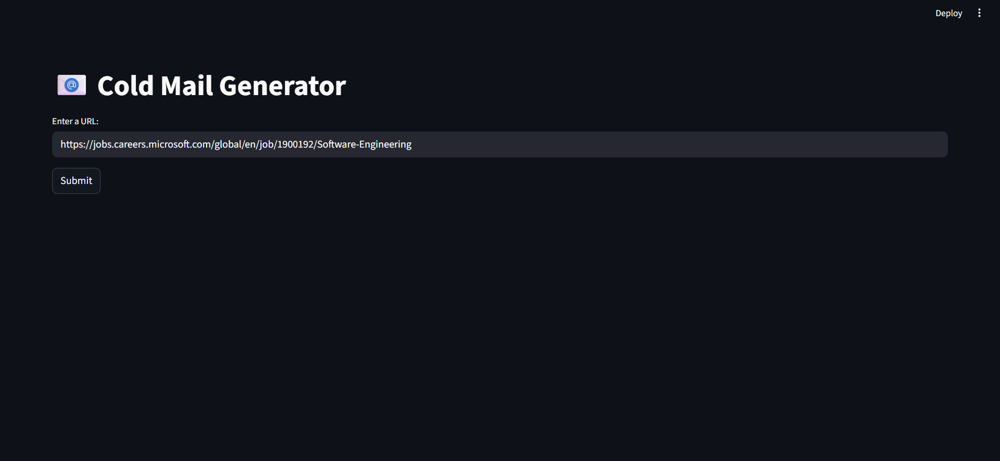
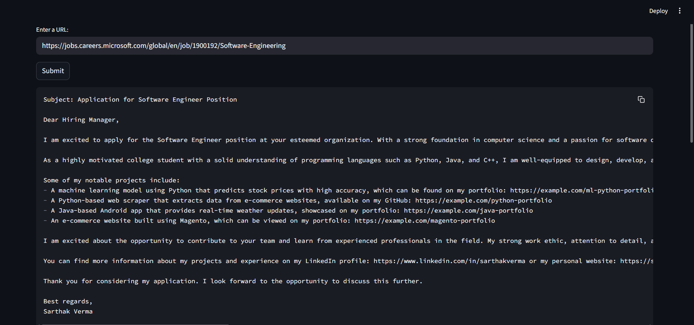
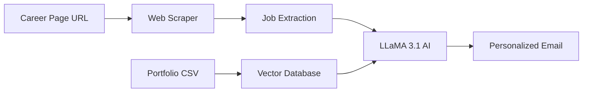

# 📧 AI-Based Cold Email Generator

<div align="center">


**Revolutionize Your Outreach with AI-Powered Personalized Cold Emails** ✉️

Generate highly personalized, compelling cold emails for job opportunities by analyzing company career pages and matching them with your portfolio. Powered by LLaMA 3.1 and intelligent web scraping.

[Features](#-features) • [Demo](#-demo) • [Installation](#-installation) • [Usage](#-usage) • [How It Works](#-how-it-works)

</div>

---

## 🎯 Overview

The **AI Cold Email Generator** is an intelligent tool designed for business development professionals, recruiters, and agencies to create personalized cold emails at scale. Simply provide a company's careers page URL, and the system will:

- 🔍 Extract job postings automatically
- 🤖 Generate tailored emails using AI
- 💼 Match opportunities with relevant portfolio links
- ⚡ Save hours of manual email writing

---

## ✨ Features

<table>
<tr>
<td width="50%">

### 🌐 **Smart Web Scraping**
Automatically extracts job listings from any company careers page using advanced web scraping techniques.

### 🧠 **AI-Powered Generation**
Leverages LLaMA 3.1 via Groq API for intelligent, context-aware email composition.

### 🎯 **Portfolio Matching**
Intelligently matches job requirements with relevant portfolio projects using vector embeddings.

</td>
<td width="50%">

### 📝 **Personalization at Scale**
Creates unique, personalized emails for each job posting without templates.

### 💾 **Vector Database**
Uses ChromaDB for efficient storage and retrieval of portfolio information.

### ⚡ **Lightning Fast**
Process multiple job listings and generate professional emails in seconds.

</td>
</tr>
</table>

---

## 🎬 Demo

### 📸 Application Screenshots

<div align="center">

| Home Interface | Email Generation |
|----------------|------------------|
|  |  |

</div>

---

## 🚀 Installation

### Prerequisites

- Python 3.8 or higher
- Groq API Key (for LLaMA 3.1 access)
- Internet connection for web scraping

### Step-by-Step Setup

**1. Clone the repository**
```bash
git clone https://github.com/Sarthak221105/ai_based_cold_email_generator.git
cd ai_based_cold_email_generator
```

**2. Create and activate virtual environment**
```bash
# Windows
python -m venv venv
venv\Scripts\activate

# macOS/Linux
python3 -m venv venv
source venv/bin/activate
```

**3. Install dependencies**
```bash
pip install -r requirements.txt
```

**4. Set up environment variables**

Create a `.env` file in the root directory:
```env
GROQ_API_KEY=your_groq_api_key_here
```

**Getting your Groq API Key:**
- Visit [Groq Console](https://console.groq.com/)
- Sign up or log in
- Navigate to API Keys section
- Create a new API key
- Copy and paste into your `.env` file

**5. Prepare your portfolio data**

Update the `resource/my_portfolio.csv` file with your portfolio information:
```csv
Techstack,Links
React,https://example.com/react-project
Python,https://example.com/python-project
Machine Learning,https://example.com/ml-project
```

---

## 💻 Usage

### Starting the Application

```bash
streamlit run app/main.py
```

The application will open in your browser at `http://localhost:8501`

### Using the Generator

**Step 1: Enter Career Page URL**
- Paste the URL of any company's careers/jobs page
- Examples: `https://company.com/careers`, `https://company.com/jobs`

**Step 2: Submit and Extract**
- Click the "Submit" button
- The system will scrape and parse job listings

**Step 3: Review Generated Emails**
- AI generates personalized emails for each position
- Emails include relevant portfolio links
- Copy and customize as needed

---

## 🔧 How It Works



### Technical Architecture

1. **Web Scraping Layer**
   - Uses LangChain's `WebBaseLoader` to fetch page content
   - Cleans and processes HTML data

2. **Job Extraction**
   - LLaMA 3.1 identifies and structures job postings
   - Extracts key details: role, skills, experience

3. **Portfolio Matching**
   - ChromaDB stores portfolio as vector embeddings
   - Semantic search matches jobs with relevant projects

4. **Email Generation**
   - AI crafts personalized emails using job details
   - Incorporates matched portfolio links naturally
   - Maintains professional tone and structure

---

## 🛠️ Tech Stack

| Technology | Purpose | Version |
|------------|---------|---------|
| **Python** | Core programming language | 3.8+ |
| **Streamlit** | Web application framework | Latest |
| **LangChain** | LLM orchestration and chains | Latest |
| **Groq** | LLaMA 3.1 API access | Latest |
| **ChromaDB** | Vector database for embeddings | Latest |
| **Pandas** | Data manipulation and CSV handling | Latest |

---

## 📁 Project Structure

```
ai_based_cold_email_generator/
│
├── app/
│   ├── main.py              # Streamlit application entry point
│   ├── chains.py            # LangChain configurations and prompts
│   └── portfolio.py         # Portfolio management and vector DB
│
├── resource/
│   └── my_portfolio.csv     # Your portfolio data (customize this)
│
├── demo/                    # Screenshots and demo media
│   ├── home.png
│   ├── job-extraction.png
│   ├── email-output.png
│   ├── step1-input.png
│   ├── step2-jobs.png
│   ├── step3-email.png
│   └── demo.gif
│
├── requirements.txt         # Python dependencies
├── .env                     # Environment variables (create this)
├── .gitignore              # Git ignore rules
└── README.md               # Project documentation
```

---

## ⚙️ Configuration

### Environment Variables

| Variable | Description | Required |
|----------|-------------|----------|
| `GROQ_API_KEY` | Your Groq API key for LLaMA access | ✅ Yes |

### Portfolio CSV Format

Your `resource/my_portfolio.csv` should follow this structure:

```csv
Techstack,Links
React & Node.js,https://github.com/user/fullstack-app
Python & ML,https://github.com/user/ml-project
AWS & DevOps,https://portfolio.com/devops-work
Data Science,https://kaggle.com/user/analysis
```

**Tips for best results:**
- Use clear, searchable technology names
- Include working, accessible links
- Keep descriptions concise but descriptive
- Update regularly with new projects

---

## 🎨 Customization

### Modifying Email Templates

Edit the prompt in `app/chains.py` to customize email style:

```python
# Adjust tone, length, or structure
# Add company-specific personalization
# Include additional context or CTAs
```

### Adding More Portfolio Fields

Extend `my_portfolio.csv` with additional columns:
- Project descriptions
- Technologies used
- Client testimonials
- Project outcomes

---

## 🤝 Contributing

Contributions make the open-source community amazing! Here's how to contribute:

1. **Fork** the repository
2. **Create** your feature branch
   ```bash
   git checkout -b feature/AmazingFeature
   ```
3. **Commit** your changes
   ```bash
   git commit -m 'Add some AmazingFeature'
   ```
4. **Push** to the branch
   ```bash
   git push origin feature/AmazingFeature
   ```
5. **Open** a Pull Request

---

## 🐛 Troubleshooting

### Common Issues

**Issue: API Key Error**
- Ensure your `.env` file exists and contains valid `GROQ_API_KEY`
- Check API key is active in Groq Console

**Issue: Web Scraping Fails**
- Verify the URL is publicly accessible
- Some sites may block automated scraping
- Try a different careers page URL

**Issue: No Portfolio Matches**
- Update `my_portfolio.csv` with relevant tech stacks
- Ensure technology names match job descriptions
- Add more diverse portfolio entries

---

## 📝 License

This project is open source and available under the [MIT License](LICENSE).

---

## 👨‍💻 Author

**Sarthak**

- GitHub: [@Sarthak221105](https://github.com/Sarthak221105)
- Project Link: [AI Cold Email Generator](https://github.com/Sarthak221105/ai_based_cold_email_generator)

---

## 🙏 Acknowledgments

- **Groq** for providing fast LLaMA 3.1 API access
- **LangChain** for the excellent LLM framework
- **Streamlit** for the intuitive web framework
- **ChromaDB** for efficient vector storage
- The open-source community for inspiration and support

---

## 📊 Use Cases

### Perfect For:

- 🏢 **Business Development Professionals** - Reach out to potential clients at scale
- 👔 **Recruiters** - Personalized outreach to companies with open positions
- 🚀 **Freelancers** - Generate custom proposals for job opportunities
- 🏭 **Agencies** - Streamline client acquisition with AI-powered emails
- 💼 **Job Seekers** - Create tailored applications for multiple positions

---

## 🔮 Future Enhancements

- [ ] Multi-language email generation
- [ ] Email template library
- [ ] A/B testing capabilities
- [ ] Integration with email clients
- [ ] Analytics dashboard
- [ ] Browser extension
- [ ] Batch processing for multiple URLs

---

## 📞 Support

Need help? We're here for you!

- 🐛 **Bug Reports**: [Open an issue](https://github.com/Sarthak221105/ai_based_cold_email_generator/issues)
- 💡 **Feature Requests**: [Start a discussion](https://github.com/Sarthak221105/ai_based_cold_email_generator/discussions)
- 📧 **Contact**: Reach out via GitHub

---

<div align="center">

**Crafted with 💙 and AI**

⭐ Star this repository if it helps your outreach efforts!

**[⬆ Back to Top](#-ai-based-cold-email-generator)**

</div>
